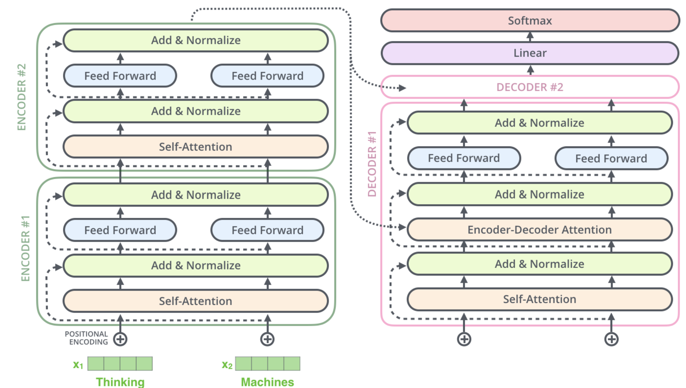

## LLM(large language model)的学习总结

### NLP模型概述与分析

#### n-gram模型

**1. 基本概念**

- **定义**：n-gram是由连续`n`个词（或字符）组成的序列，用于捕捉文本中的局部上下文规律。
  - 示例：句子"I love natural language processing"的2-gram分解为：`I-love`, `love-natural`, `natural-language`, `language-processing`。
- **常见类型**：
  - **Unigram (1-gram)**：单词（如`I`, `love`）。
  - **Bigram (2-gram)**：双词序列（如`I-love`）。
  - **Trigram (3-gram)**：三词序列（如`love-natural-language`）。
  - 更大的`n`（如4-gram）能捕捉更长上下文，但数据稀疏性加剧。

**2. 概率计算**
- **目标**：计算句子`S = w_1, w_2, ..., w_m`的概率：

$$P(S) = P(w_1) \cdot P(w_2|w_1) \cdot P(w_3|w_1,w_2) \cdots P(w_m|w_{m-n+1},...,w_{m-1})$$

- **极大似然估计（MLE）**：

$$P(w_t | w_{t-n+1}, ..., w_{t-1}) = \frac{\text{count}(w_{t-n+1}, ..., w_t)}{\text{count}(w_{t-n+1}, ..., w_{t-1})}$$

- **例如，计算`P(processing | language)`**：
  
$$P(\text{processing} | \text{language}) = \frac{\text{"language processing"的出现次数}}{\text{"language"的出现次数}}$$

**3. 优缺点分析**
| **优点**                  | **缺点**                  |
|---------------------------|---------------------------|
| 简单高效，计算速度快       | 长距离依赖捕捉能力弱       |
| 可解释性强                | `n`增大时参数指数级增长    |
| 适合小规模数据            | 数据稀疏性问题严重         |

**4. 应用场景**
1. **文本生成**：基于历史词预测下一个词（如输入法提示）。  
2. **拼写纠错**：检测低概率n-gram定位错误（如`I are`→`I am`）。  
3. **信息检索**：计算查询与文档的相关性（如BM25算法结合n-gram）。  

**5. 实例演示**
**句子**："The cat sits on the mat"  
- **Bigram概率计算**：

$$P(\text{sits} | \text{cat}) = \frac{\text{"cat sits"出现次数}}{\text{"cat"出现次数}}$$

- 若语料中`cat`出现100次，`cat sits`出现30次，则： $P(\text{sits} | \text{cat}) = 30/100 = 0.3$
- **Python代码示例(n-gram)**: [`n_gram.py`](./n_gram.py)


#### 词袋模型（Bag of Words, BoW）

**1. 基本概念**
- **定义**：词袋模型是一种将文本表示为**单词出现频率**的简化模型。它忽略语法、词序和上下文，仅关注词汇的出现情况。
  - 示例：句子 "The cat sat on the mat" 和 "The dog ate the cat" 的词袋表示为：
    ```python
    {"the":2, "cat":1, "sat":1, "on":1, "mat":1}  
    {"the":2, "dog":1, "ate":1, "cat":1}
    ```

**2. 核心思想**
- **文本向量化**：将文本转换为固定长度的数值向量，每个维度对应一个单词。
- **两种主要表示形式**：
  1. **词频（Term Frequency, TF）**：统计单词出现次数
  2. **二元存在（Binary）**：仅记录单词是否出现（0/1）

**3. 构建步骤**

**3.1 预处理流程**
1. **分词**：将文本分割为单词/词语  
   `"I love NLP" → ["I", "love", "NLP"]`
2. **去停用词**：移除常见无意义词（可选）  
   `["the", "is", "and"] → 移除`
3. **词干提取**：还原单词词根（可选）  
   `"running" → "run"`
4. **构建词典**：收集所有唯一单词并编号  
   `{"apple":0, "banana":1, "cat":2, ...}`
5. **向量化**：根据词典生成数值向量

**3.2 数学表示**
- 文本向量维度 = 词典大小（V）
- 第i个元素的值为对应单词的统计量：

$$\text{向量} = [\text{count}(w_1), \text{count}(w_2), ..., \text{count}(w_V)]$$

**4. 优缺点分析**

| **优点**                     | **缺点**                     |
|------------------------------|-----------------------------|
| 简单易实现，计算效率高       | 忽略词序和语法结构           |
| 适合作为基线模型             | 无法捕捉语义关系             |
| 适用于小规模数据             | 高维稀疏性问题（维度灾难）   |
| 可解释性强                   | 对同义词处理能力差           |

**5. 应用场景**
1. **文本分类**：垃圾邮件检测、情感分析  
   `（特征：关键词"免费","优惠"的出现频率）`
2. **信息检索**：文档相似度计算  
   `余弦相似度：cosθ = (A·B)/(||A||·||B||)`
3. **推荐系统**：用户兴趣建模  
   `用户历史行为 → 商品关键词向量`

**6. 实例演示**
- **Python代码示例(BoW)**: [`bag_of_words.py`](./bag_of_words.py)

#### Word2Vec类型的 Skip-gram 词嵌入模型

**1. 核心思想**
- **目标**：通过中心词预测其上下文词，学习低维稠密的词向量表示。
- **核心假设**：语义相似的词会出现在相似的上下文中。
- **输入输出**：
  - 输入：中心词（one-hot编码）
  - 输出：窗口内各位置上下文词的概率分布

**2. 模型特点**
| **优点**                  | **缺点**                  |
|---------------------------|---------------------------|
| 适合处理低频词           | 训练速度较慢              |
| 捕捉复杂语义模式         | 原始版本计算复杂度高      |
| 生成的词向量线性特性好   | 需要大量语料数据          |

**3. 实例演示**
- **Python代码示例(Skip-gram)**: [`skip_gram.py`](./skip_gram.py)

#### Word2Vec类型的 CBOW（连续词袋）模型

**1. 核心思想**
- **目标**：通过上下文词预测中心词，学习词向量表示
- **核心假设**：相同中心词会有相似的上下文分布
- **输入输出**：
  - 输入：窗口内所有上下文词（多个one-hot编码）
  - 输出：中心词的概率分布

**2. 模型特点**
| **优点**                  | **缺点**                  |
|---------------------------|---------------------------|
| 训练速度快               | 对低频词捕捉能力较弱      |
| 适合处理高频词           | 简单上下文组合可能丢失信息|
| 计算资源消耗较少         | 原始版本需要完整softmax   |

**3. 实例演示**
- **Python代码示例(CBOW)**: [`cbow.py`](./cbow.py)

#### Bag-of-Words (BoW) 与 Word2Vec 对比分析

| **对比维度**         | **Bag-of-Words (BoW)**                                                                 | **Word2Vec**                                                                               |
|----------------------|---------------------------------------------------------------------------------------|--------------------------------------------------------------------------------------------|
| **基本思想**         | 基于词频统计的离散表示                                                                | 基于上下文预测的连续向量表示                                                                |
| **语义捕捉**         | 无语义信息                                                                            | 捕捉词汇语义和语法关系                                                                      |
| **维度特性**         | 高维稀疏（维度=词汇表大小）                                                           | 低维稠密（典型维度50-300）                                                                  |
| **词序处理**         | 完全忽略词序                                                                          | 通过上下文窗口隐含考虑词序                                                                  |
| **✅ 优点**           | 1. 实现简单，计算速度快<br>2. 适合小规模数据快速原型开发<br>3. 可解释性强（直接对应词频） | 1. 捕获语义相似性（如：king - man + woman ≈ queen）<br>2. 低维稠密表示节省存储<br>3. 支持词向量算术运算 |
| **❌ 缺点**           | 1. 无法处理未登录词（OOV）<br>2. 忽略词序和语义关系<br>3. 维度灾难（高维稀疏性问题）    | 1. 需要大量训练数据<br>2. 训练时间较长<br>3. 无法动态更新（静态嵌入）                        |

#### Neural Probabilistic Language Model (NPLM) 模型

**1. 基本概念**
- NPLM（Neural Probabilistic Language Model）是由 Yoshua Bengio 等人于 2003 年提出，是早期将神经网络应用于语言模型的经典工作。它解决了传统 n-gram 模型的以下问题：
  - 数据稀疏性：n-gram 无法有效处理低频或未登录词。
  - 维度灾难：n 增大时参数空间指数级增长。
  - 缺乏语义泛化：无法捕捉词语间的相似性。

**2. 核心思想**
- NPLM 是**通过神经网络学习词的分布式表示（词向量）**，并基于上下文预测下一个词的概率。

**2.1 输入层**
- **上下文窗口**：给定前 `n-1` 个词 `w_{t-1}, w_{t-2}, ..., w_{t-n+1}`。
- **词索引映射**：将每个词转换为词典中的整数索引。

**2.2 嵌入层 (Embedding Layer)**
- **词向量矩阵** `C`：维度为 `V × m`，其中 `V` 是词典大小，`m` 是词向量维度。
- **上下文向量拼接**：将 `n-1` 个词向量拼接为 `(n-1)*m` 维向量。

**2.3 隐藏层**
- **全连接层**：将拼接后的向量映射到隐藏层：

$$h = \tanh(W \cdot concat(C(w_{t-1}), ..., C(w_{t-n+1})) + b)$$

  其中 `W` 是权重矩阵，`b` 是偏置项。

**2.4 输出层**
- **Softmax 概率分布**：预测下一个词的概率：

$$P(w_t | w_{t-1}, ..., w_{t-n+1}) = \frac{\exp(U \cdot h + c)}{\sum_{k=1}^V \exp(U_k \cdot h + c_k)}$$

  其中 `U` 是输出权重矩阵，`c` 是偏置。


**3. 实例演示**
- **Python代码示例(NPLM)**: [`nplm.py`](./nplm.py)

#### LSTM与RNN模型

**1. 模型简介**

**1.1 RNN (循环神经网络)**
- **结构特点**：
  - 时间步间共享参数
  - 隐藏状态传递历史信息
  - 基础公式： $h_t = \tanh(W_{xh}x_t + W_{hh}h_{t-1} + b_h)$
- **优势**：
  - 处理变长序列
  - 捕捉时间依赖性
- **缺陷**：
  - 梯度消失/爆炸问题
  - 长期记忆能力差

**1.2 LSTM (长短期记忆网络)**
- **核心改进**：
  - 引入门控机制（遗忘门、输入门、输出门）
  - 细胞状态长期记忆
  - 核心公式：
    - 遗忘门： $f_t = \sigma(W_f \cdot [h_{t-1}, x_t] + b_f)$
    - 输入门： $i_t = \sigma(W_i \cdot [h_{t-1}, x_t] + b_i)$
    - 输出门： $o_t = \sigma(W_o \cdot [h_{t-1}, x_t] + b_o)$
    - 最终输出： $h_t = o_t \odot \tanh(C_t)$
- **优势**：
  - 解决长期依赖问题
  - 梯度流动更稳定
- **缺陷**：
  - 计算复杂度高：每个时间步需要计算3个门和细胞状态，参数量是普通RNN的4倍
  - 并行化困难：时间步间依赖导致难以充分利用GPU并行计算
  - 超参数敏感：隐藏层大小、学习率、遗忘门初始化等对性能影响显著

**2. 实例演示**
- **Python代码示例(RNN/LSTM)**: [`lstm.py`](./lstm.py)

#### Seq2Seq模型

**1. 基本概念**
- **​Sequence-to-Sequence（Seq2Seq）​**​ 是一种深度学习模型，用于处理输入和输出均为​**​变长序列​**​的任务。其核心结构由​**​编码器（Encoder）​**​和​**​解码器（Decoder）​**​组成，通常基于循环神经网络（RNN）、长短期记忆网络（LSTM）或门控循环单元（GRU）。  
- ​**​目标​**​：将输入序列映射到固定长度的中间表示（上下文向量），再基于此生成输出序列。
- ​**​经典场景​**​：如机器翻译、文本摘要等输入输出长度不一致的任务。

**2. 数学原理**

**编码器（Encoder）**
- 输入序列 $\mathbf{X} = (x_1, x_2, ..., x_T)$ 经过编码器逐时刻处理，生成隐藏状态序列 $\{h_1, h_2, ..., h_T\}$，最终取最后一个隐藏状态 $h_T$ 作为输入序列的​**​全局上下文向量​**​ $\mathbf{c}$：
  
$$h_t = f(x_t, h_{t-1})$$

- $f$表示RNN、LSTM或GRU的迭代计算函数。

**解码器（Decoder）**
- 解码器以 $\mathbf{c}$ 为初始状态，逐步生成输出序列 $\mathbf{Y} = (y_1, y_2, ..., y_{T'})$ ：

```math
s_t = g(y_{t-1}, s_{t-1}, \mathbf{c}), \quad P(y_t | y_{1:t-1}, \mathbf{c}) = \text{softmax}(W s_t)
```

- $s_t$是解码器的隐藏状态，g为RNN单元。
- 通过条件概率逐词生成输出序列。

**损失函数**
- 最小化输出序列的负对数似然：

```math
\mathcal{L} = -\sum_{t=1}^{T'} \log P(y_t^* | y_1^*, \dots, y_{t-1}^*, \mathbf{c})
```

- $y_t^*$ 为真实输出序列的词。


**3. 优缺点分析**

**优点**
1. ​**​处理变长序列​**​：天然支持输入输出长度动态变化的任务。
2. ​**​端到端训练​**​：无需人工设计特征，模型自动学习映射关系。
3. ​**​通用性强​**​：适用于翻译、生成等多种序列任务。

**缺点**
1. ​**​信息瓶颈​**​：编码器的上下文向量 $\mathbf{c}$ 难以完整捕捉长输入序列的信息。
2. ​**​误差累积​**​：解码时逐词生成的误差会传播至后续步骤。
3. ​**​训练耗时​**​：解码阶段无法并行化，长序列生成效率低。

**4. 应用场景**

1. ​**​机器翻译​**​  
   - 输入：源语言句子（如英文）；输出：目标语言句子（如中文）。
2. ​**​文本摘要​**​  
   - 输入：长篇文章；输出：摘要文本。
3. ​**​对话系统​**​  
   - 输入：用户对话历史；输出：机器回复。
4. ​**​语音识别​**​  
   - 输入：语音信号序列；输出：文本转录。
5. ​**​代码生成​**​  
   - 输入：自然语言描述；输出：代码片段（如SQL查询）。

**5. 实例演示**

**其中用到的一些训练推理方法**

**训练阶段：教师强制（Teacher Forcing）**
- 教师强制是一种在训练序列生成模型（如RNN、LSTM）时使用的技术。其核心思想是在训练过程中，解码器每一步的输入使用真实的目标序列词（ground truth），而不是模型前一步的预测结果。

**工作方式**

在机器翻译的训练阶段，解码器的输入是真实目标序列的前一个词，而不是模型预测的词。

**优缺点**

- **优点**：加速模型收敛，避免错误累积，适合作为基线训练策略。
- **缺点**：导致曝光偏差，训练与推理场景不一致，模型未学习错误恢复能力。

**示例**

- **训练阶段**：输入序列为"我 喜欢 苹果"，解码器始终使用真实标签 `<sos> I like apples` 作为输入。
- **推理阶段**：模型需自行生成 `<sos> → I → …`，若中间预测错误（如生成 `apple` 而非 `apples`），误差会累积。

**推理阶段：曝光偏差（Exposure Bias）**
- 曝光偏差是指在训练时模型总是接触到正确的信息，而在推理时模型可能会生成错误的预测，导致模型在推理时表现不佳。

**影响**
- 模型对自身预测中的错误敏感，缺乏纠错能力。
- 在长序列生成时，错误会逐步累积，最终输出偏离目标。

**示例**

- **训练时**：解码器输入为 `<sos>` → A → B → C（真实标签）。
- **推理时**：解码器输入为 `<sos>` → A → D → ?（若第二步预测错误为D），模型未在训练中见过D后的情况，导致后续预测可能完全错误。

**训练阶段：计划采样（Scheduled Sampling）**
- 计划采样是一种技术，用于减少曝光偏差，通过在训练过程中逐渐从使用真实目标输出过渡到使用模型的预测。

**实现方式**
设定一个概率 $p$，表示使用真实标签的概率。
- 训练初期 $p$ 较高（如0.9），后期逐渐降低（如0.1）。

**公式**

输入 $x_t$ 由以下方式决定：

$$
x_t = 
\begin{cases} 
y_{t-1} & \text{以概率 } p \\
\hat{y}_{t-1} & \text{以概率 } 1-p
\end{cases}
$$

其中 $y_{t-1}$ 是真实标签，而 $\hat{y}_{t-1}$ 是模型预测的标签。

**算法流程**

1. 初始化概率 $p = 1$（完全使用真实标签）。
2. 每个训练步以概率 $p$ 选择真实词，否则使用模型预测词。
3. 随着训练轮次增加，线性或指数衰减 $p$。

- **Python代码示例(Seq2Seq)**: [`seq2seq.py`](./seq2seq.py)

#### Transformer架构模型

**1. 核心思想**
- Transformer是一种**完全基于注意力机制**的序列建模架构，其核心创新在于：
  - **并行计算**：抛弃RNN的时序依赖，实现全序列并行处理
  - **动态上下文建模**：通过自注意力捕捉任意位置词元间的关联
  - **位置感知编码**：显式注入位置信息以弥补注意力机制的位置不敏感性

**2. 整体架构**


**3. 编码器详解**

**3.1 输入处理**
- **词元嵌入**：将离散词元映射为连续向量  
  $E \in \mathbb{R}^{V \times d},\ X = E(W)$  
  $V$: 词表大小，d: 嵌入维度

**3.2 位置编码**
- **绝对位置编码**：通过三角函数注入位置信息

$$
\begin{aligned}
PE\_{(pos,2i)} &= \sin\left(\frac{pos}{10000^{2i/d}}\right) \\
PE\_{(pos,2i+1)} &= \cos\left(\frac{pos}{10000^{2i/d}}\right)
\end{aligned}
$$

- **最终输入**： $Z = X + PE$

**3.3 编码层结构**
每层包含两个核心子层：
1. **多头自注意力**
   - 计算词元间动态关联权重
   - 允许并行捕获不同位置的语义关联

2. **前馈网络（FFN）**
   - 非线性变换增强表示能力：

  $$FFN(x) = \max(0, xW_1 + b_1)W_2 + b_2$$

3. **残差连接 & 层归一化**

  $$\text{LayerNorm}(x + \text{Sublayer}(x))$$

**4. 解码器结构**

**核心差异**
- **掩码自注意力**：遮挡未来词元，防止训练阶段信息泄露
- **交叉注意力**：连接编码器输出与当前解码状态

**解码层流程**
1. **掩码多头自注意力**
   - 仅允许关注已生成词元
   - 确保自回归生成的因果性

2. **编码-解码注意力**
   - Key/Value来自编码器输出
   - Query来自解码器当前状态

3. **前馈网络**
   - 与编码器结构相同

**5. 注意力机制**

**5.1 缩放点积注意力**

$$\text{Attention}(Q,K,V) = \text{softmax}\left(\frac{QK^T}{\sqrt{d_k}}\right)V$$

- $Q$ (Query)：当前关注焦点
- $K$ (Key)：待匹配的特征标识
- $V$ (Value)：实际信息载体

**5.2. 多头注意力**
- **并行化计算**：将Q/K/V拆分至多个子空间

$$\text{head}_i = \text{Attention}(QW_i^Q, KW_i^K, VW_i^V)$$

- **特征融合**：拼接各头结果后线性变换  

$$\text{MultiHead} = \text{Concat}(\text{head}_1,...,\text{head}_h)W^{Output}$$

**6. 位置编码**

**核心需求**
- 保持词元间相对位置关系
- 适应任意长度序列外推

**改进方向**
1. **相对位置编码**：计算词元间相对距离偏置
2. **可学习编码**：通过参数学习位置表示
3. **旋转位置编码（RoPE）**：通过复数空间旋转保持相对位置(llama模型)


**7. 损失函数**
- **交叉熵损失**：最小化预测分布与真实分布的差异： 

$$L = -\sum_{t=1}^T \log P(y_t|y_{1:t-1}, X)$$

**8. 优缺点分析**

**优点**
- **并行效率**：充分利用GPU矩阵运算
- **长程建模**：任意位置词元直接交互
- **多模态适配**：统一处理文本/语音/图像

**缺点**
- **计算复杂度**：注意力矩阵的 $O(n^2)$ 成本
- **位置外推**：超越训练长度的序列处理困难
- **数据依赖**：小数据场景易过拟合

**9. 代码实现**
- **Python代码具体详解在gpt_model中(GPT等生成式模型仅用到了解码器结构)**

### 应用部署LLM框架简介(LangChain)

#### LangChain简介与用法
- LangChain：一个用于构建语言模型驱动应用程序的开源框架(Python/JS)，专注于将大型语言模型(LLMs)与外部数据源、工具和复杂逻辑结合，实现更强大的应用场景。核心优势在于模块化设计，开发者可灵活组合不同组件

- 核心组件
  - Models: 支持多种 LLM(如 OpenAI、Hugging Face 等)和 Embedding 模型
  - Chains: 将多个组件组合成工作流(例如：用户输入 → 模型处理 → 解析输出 → 调用 API)
  - Memory: 管理对话历史或上下文信息(如聊天记录)
  - Agents: 让模型自主选择调用工具(如搜索、计算、数据库查询)
  - Indexes: 处理外部数据(文档加载、向量存储、检索)

#### 使用示例
- 示例 1：简单问答
```python
from langchain.llms import OpenAI

llm = OpenAI(temperature=0.9)  # temperature 控制随机性 (0-1)
response = llm("用一句话解释量子力学")
print(response)
# 输出：量子力学是研究微观粒子运动规律的物理理论，其核心是波函数和概率性描述
```

- 示例 2：链式处理(Chains)
```python
# 组合提示模板和模型
from langchain.prompts import PromptTemplate
from langchain.chains import LLMChain

prompt_template = PromptTemplate(
    input_variables=["topic"],
    template="用通俗语言解释{topc}是什么？"
)

chain = LLMChain(llm=OpenAI(), prompt=prompt_template)
result = chain.run("黑洞")
print(result)
# 输出：黑洞就像宇宙中的一个超级吸尘器，连光都逃不出来...
```

- 示例 3：代理(Agents)
```python
# 让模型自主使用工具
from langchain.agents import load_tools
from langchain.agents import initialize_agent
from langchain.llms import OpenAI

tools = load_tools(["serpapi"], llm=OpenAI())  # 需要 SERPAPI_KEY
agent = initialize_agent(tools, OpenAI(), agent="zero-shot-react-description", verbose=True)

agent.run("2023年全球票房最高的电影是哪部？")
# 模型自动调用搜索引擎工具查找答案
```

示例 4：文档问答
```python
# 处理外部文档
from langchain.document_loaders import WebBaseLoader
from langchain.indexes import VectorstoreIndexCreator

loader = WebBaseLoader(["https://zh.wikipedia.org/wiki/人工智能"])
index = VectorstoreIndexCreator().from_loaders([loader])

query = "人工智能的主要应用领域有哪些？"
answer = index.query(query)
print(answer)
# 典型应用场景：智能客服(结合知识库)、自动化数据分析报告生成、文档摘要与问答系统、代码生成与解释工具、定制化搜索引擎等
```

### LLM中的一些核心概念术语

- agent(智能体)：一种以大语言模型驱动的人工智能程序，能够自主感知环境并采取行动以实现目标，拥有自主推理决策、规划行动、检索记忆、选择工具执行任务等能力

- AI hallucination(AI幻觉)：AI 生成的内容与现实世界的知识不一致或与实际数据显著不同的现象，简称为"一本正经的胡说八道"

- catastrophic forgetting(灾难性遗忘)：这是模型的一种倾向，具体指模型在学习新数据时忘记先前学到的信息。这种限制主要影响循环神经网络(RNN和LSTM等)。循环神经网络在处理长文本序列时难以保持上下文

- chain of thought(CoT-思维链)：一种提示工程技术，核心思想是通过向大语言模型展示少量的示例，在示例中将具体问题拆分成多个推理步骤，并要求模型遵循多步，比如"让我们逐步思考"。这会改善模型在执行复杂的推理任务(算术推理、常识推理和符号推理)时的表现

- context window(上下文窗口)：大语言模型在生成信息时可以处理的目标标记周围的文本范围。上下文窗口大小对于理解和生成与特定上下文相关的文本至关重要。一般而言，较大的上下文窗口可以提供更丰富的语义信息

- embedding(嵌入)：表示词语或句子且能被机器学习模型处理的实值向量。对于值较为接近的向量，它们所表示的词语或句子也具有相似的含义

- Facebook AI Similarity Search(Faiss，Facebook AI 相似性搜索)：Facebook AI 团队开源的针对聚类和相似性搜索的库，为稠密向量提供高效的相似性搜索和聚类，支持十亿级别向量的搜索，是目前较为成熟的近似近邻搜索库

- few-shot learning(少样本学习)：仅用很少的示例训练机器学习模型的技术。对于大语言模型而言，这种技术可以根据少量的输入示例和输出示例来引导模型响应

- zero-shot learning(零样本学习)：一个机器学习概念，即大语言模型对在训练期间没有明确见过的情况进行预测。任务直接呈现在提示词中，模型利用其预训练的知识生成回应

- fine-tuning(微调)：在微调过程中，预训练模型在一个较小、特定的数据集上进一步训练。微调旨在重复使用预训练模型的特征，并使其适应于特定任务。对于神经网络来说，这意味着保持结构不变，仅稍微改变模型的权重，而不是从头开始构建模型

- long short-term memory(LSTM，长短期记忆)：一种用于处理序列数据中的短期及长期依赖关系的循环神经网络架构。但目前基于 Transformer 的大语言模型(如 GPT 模型)不再使用LSTM，而使用注意力机制

- prompt(提示词)：输入给语言模型的内容，模型通过它生成一个输出。比如，在 GPT 模型中，提示词可以是半句话或一个问题，模型将基于此补全文本

- prompt engineering(提示工程)：设计和优化提示词，以从语言模型中获得所需的输出。这可能涉及指定响应的格式，在提示词中提供示例，或要求模型逐步思考

- prompt injection(提示词注入)：一种特定类型的攻击，通过在提示词中提供精心选择的奖励，使大语言模型的行为偏离其原始任务

- recurrent neural network(RNN，循环神经网络)：一类表现出时间动态行为的神经网络，适用于涉及序列数据的任务，如文本或时间序列。

- reinforcement learning(RL，强化学习)：一种机器学习方法，专注于在环境中训练模型以最大化奖励信号。模型接收反馈并利用该反馈来进一步学习和自我改进

- reinforcement learning from human feedback(RLHF，通过人类反馈进行强化学习)：一种将强化学习与人类反馈相结合的训练人工智能系统的先进技术，该技术涉及使用人类反馈来创建奖励信号，继而使用该信号通过强化学习来改进模型的行为

- supervised fine-tuning(SFT，监督微调)：采用预先训练好的神经网络模型，并针对特定任务或领域在少量的监督数据上对其进行重新训练

- supervised learning(监督学习)：一种机器学习方法，可以从训练资料中学到或建立一个模式，以达到准确分类或预测结果的目的

- temperature(温度)：大语言模型的一个参数，用于控制模型输出的随机性。温度值越高，模型结果的随机性越强；温度值为 0 表示模型结果具有确定性(在OpenAI 模型中，温度值为 0 表示模型结果近似确定)

- transfer learning(迁移学习)：一种机器学习技术，其中在一个任务上训练的模型被重复利用于另一个相关任务。比如，GPT 在大量文本语料库上进行预训练，然后可以使用较少的数据进行微调，以适用于特定任务

- unsupervised learning(无监督学习)：一种机器学习方法，它使用机器学习算法来分析未标记的数据集并进行聚类。这些算法无须人工干预即可发现隐藏的模式或给数据分组
